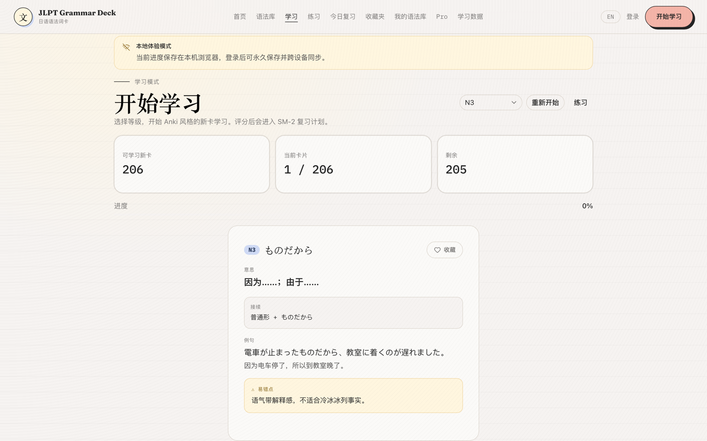
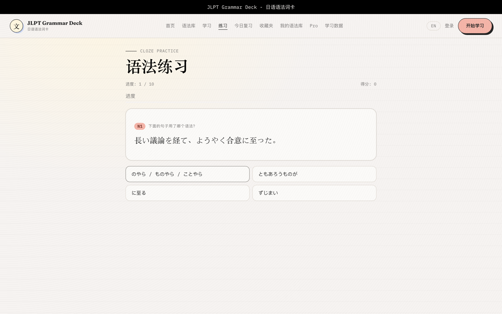
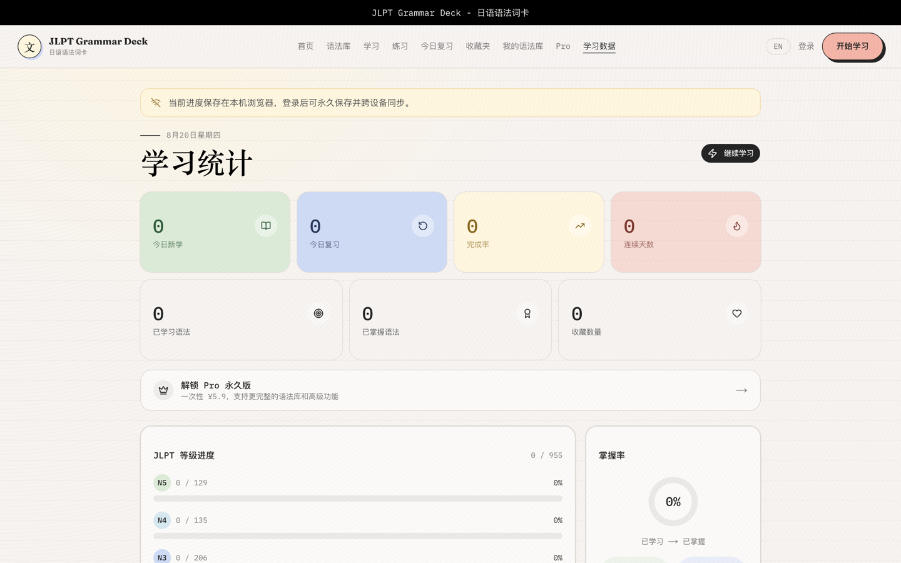

<div align="center">

# JLPT Grammar Deck

**Anki 风格的 JLPT 日语语法学习工具**

[](https://jlpt-grammar-cards.com)
[](./LICENSE)
[](https://nextjs.org)
[](https://supabase.com)

**[🌐 在线体验 / Live Demo / デモ](https://jlpt-grammar-cards.com)**

[简体中文](#简体中文) · [English](#english) · [日本語](#日本語)

</div>

---

<a name="简体中文"></a>

## 简体中文

覆盖 N5–N1 全等级、**955 条**语法的日语学习工具。用 Anki 式卡片记忆，配合 SM-2 间隔重复算法安排复习，并提供自动生成的填空练习题。无需注册即可开始学习。

### 功能

| 功能 | 说明 |
|---|---|
| **语法库** | 955 条 JLPT 语法（N5 129 / N4 135 / N3 206 / N2 233 / N1 252），按等级、语法类型、学习状态筛选 |
| **卡片学习** | 正面语法，背面意思、接续、例句与易错点，四级评分（忘记 / 模糊 / 记住 / 简单） |
| **SM-2 复习** | 依据遗忘曲线自动安排下次复习时间，到期卡片进入复习队列 |
| **填空练习** | 从例句自动生成选择题，可按「今日练过 / 学过的 / 全部语法」出题 |
| **收藏与个人语法库** | 收藏重点语法，添加私有条目，隐藏不需要的默认语法 |
| **学习数据** | 学习进度、等级分布、复习趋势、评分分布 |
| **访客模式** | 无需登录即可学习，进度存于本地，登录后自动同步 |
| **多语言** | 中文 / English 界面切换 |

### 界面预览

| 首页 | 卡片学习 |
|---|---|
|  |  |

| 填空练习 | 学习数据 |
|---|---|
|  |  |

### 技术栈

- **前端** — Next.js 16（App Router）· React 19 · TypeScript · Tailwind CSS v4
- **后端** — Supabase（PostgreSQL · Auth · Row Level Security）
- **测试** — Vitest
- **部署** — Vercel

### 本地开发

```bash
npm install
npm run dev          # http://localhost:3000
```

在项目根目录创建 `.env.local`：

```env
NEXT_PUBLIC_SUPABASE_URL=your-supabase-url
NEXT_PUBLIC_SUPABASE_ANON_KEY=your-anon-key
SUPABASE_SERVICE_ROLE_KEY=your-service-role-key
```

数据库结构见 `supabase/migrations/`，按编号顺序在 Supabase SQL Editor 中执行。

### 常用命令

```bash
npm run dev                 # 启动开发服务器
npm run build               # 生产构建
npm run lint                # 代码检查
npm run typecheck           # 类型检查
npm test                    # 运行测试
npm run grammar:audit       # 语法数据审计
```

---

<a name="english"></a>

## English

A Japanese grammar learning tool covering all JLPT levels (N5–N1) with **955 grammar points**. Study with Anki-style flashcards, review on an SM-2 spaced-repetition schedule, and practise with auto-generated cloze questions. No sign-up required to start.

### Features

| Feature | Description |
|---|---|
| **Grammar library** | 955 JLPT grammar points (N5 129 / N4 135 / N3 206 / N2 233 / N1 252), filterable by level, type and study status |
| **Flashcards** | Grammar on the front; meaning, conjugation, examples and pitfalls on the back, with four-level rating |
| **SM-2 review** | Schedules the next review from your rating; due cards flow into the review queue |
| **Cloze practice** | Multiple-choice questions generated from example sentences, scoped to today's / studied / all grammar |
| **Favorites & personal library** | Save key grammar, add private entries, hide defaults you don't need |
| **Analytics** | Study progress, level breakdown, review trends and rating distribution |
| **Guest mode** | Study without an account — progress is kept locally and syncs after sign-in |
| **Bilingual UI** | Switch between Chinese and English |

### Screenshots

| Home | Study |
|---|---|
|  |  |

| Practice | Analytics |
|---|---|
|  |  |

### Tech stack

- **Frontend** — Next.js 16 (App Router) · React 19 · TypeScript · Tailwind CSS v4
- **Backend** — Supabase (PostgreSQL · Auth · Row Level Security)
- **Testing** — Vitest
- **Hosting** — Vercel

### Local development

```bash
npm install
npm run dev          # http://localhost:3000
```

Create `.env.local` in the project root:

```env
NEXT_PUBLIC_SUPABASE_URL=your-supabase-url
NEXT_PUBLIC_SUPABASE_ANON_KEY=your-anon-key
SUPABASE_SERVICE_ROLE_KEY=your-service-role-key
```

The schema lives in `supabase/migrations/` — run the files in numeric order in the Supabase SQL Editor.

### Scripts

```bash
npm run dev                 # start the dev server
npm run build               # production build
npm run lint                # lint
npm run typecheck           # type check
npm test                    # run tests
npm run grammar:audit       # audit grammar data
```

---

<a name="日本語"></a>

## 日本語

JLPT 全レベル（N5〜N1）**955 項目**の文法を収録した日本語学習ツールです。Anki 形式のカードで暗記し、SM-2 間隔反復アルゴリズムで復習を管理、例文から自動生成される穴埋め問題で演習できます。登録なしで学習を始められます。

### 機能

| 機能 | 説明 |
|---|---|
| **文法ライブラリ** | JLPT 文法 955 項目（N5 129 / N4 135 / N3 206 / N2 233 / N1 252）。レベル・文法種別・学習状況で絞り込み |
| **カード学習** | 表に文法、裏に意味・接続・例文・間違えやすい点。4 段階で自己評価 |
| **SM-2 復習** | 評価に応じて次回の復習日を自動設定。期限が来たカードは復習キューへ |
| **穴埋め演習** | 例文から選択問題を自動生成。「今日の学習分 / 学習済み / 全文法」から出題範囲を選択 |
| **お気に入り・マイ文法** | 重要な文法を保存、独自の項目を追加、不要な既定文法を非表示に |
| **学習データ** | 学習進捗、レベル別内訳、復習の推移、評価の分布 |
| **ゲストモード** | 登録なしで学習可能。進捗はローカルに保存され、ログイン後に同期 |
| **多言語対応** | 中国語 / 英語の UI 切り替え |

### スクリーンショット

| ホーム | 学習 |
|---|---|
|  |  |

| 演習 | 学習データ |
|---|---|
|  |  |

### 技術スタック

- **フロントエンド** — Next.js 16（App Router）· React 19 · TypeScript · Tailwind CSS v4
- **バックエンド** — Supabase（PostgreSQL · Auth · Row Level Security）
- **テスト** — Vitest
- **ホスティング** — Vercel

### ローカル開発

```bash
npm install
npm run dev          # http://localhost:3000
```

プロジェクト直下に `.env.local` を作成します：

```env
NEXT_PUBLIC_SUPABASE_URL=your-supabase-url
NEXT_PUBLIC_SUPABASE_ANON_KEY=your-anon-key
SUPABASE_SERVICE_ROLE_KEY=your-service-role-key
```

スキーマは `supabase/migrations/` にあります。Supabase の SQL Editor で番号順に実行してください。

### コマンド

```bash
npm run dev                 # 開発サーバー起動
npm run build               # 本番ビルド
npm run lint                # Lint
npm run typecheck           # 型チェック
npm test                    # テスト実行
npm run grammar:audit       # 文法データ検査
```

---

<div align="center">

MIT License · [jlpt-grammar-cards.com](https://jlpt-grammar-cards.com)

</div>
